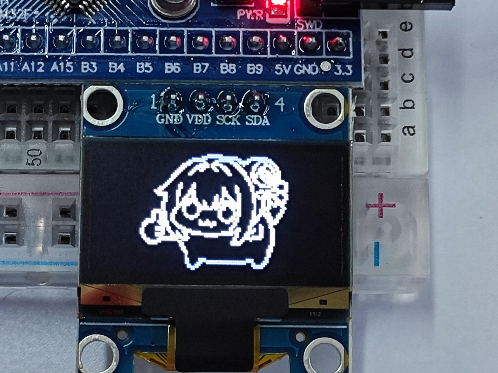

# STM32 OLED 自定义卡通图案显示

这是我的第一个代码仓库，也是我学习 STM32 时完成的一个小项目。

项目使用 **STM32F103C8T6** 驱动 **128×64 单色 OLED**，在学习 OLED 字符显示的基础上，增加了一张自定义卡通点阵图。

> 学习说明：本工程的 STM32 标准外设库、启动文件、工程模板和 OLED 基础函数参考了 B 站 **江协科技** 的 STM32 入门教程。我在学习这些基础代码后，增加了 `OLED_Cartoon.h`、卡通点阵数据和图片显示调用。感谢原教程作者的分享。

## 实物效果

<p align="center">
  
</p>

## 项目做了什么

1. 使用 PB8 和 PB9 模拟 I²C，与 OLED 通信；
2. 学习字符、字符串和数字是怎样通过点阵显示出来的；
3. 把 AI 辅助处理的卡通图转换为 1024 字节数组，并显示到 128×64 OLED 上。

## 硬件要求

| 硬件 | 数量 | 说明 |
|---|---:|---|
| STM32F103C8T6 开发板 | 1 | 本工程使用的主控 |
| 0.96 英寸 128×64 OLED | 1 | I²C 接口，常见驱动芯片为 SSD1306 |
| ST-Link | 1 | 下载和调试程序 |
| 杜邦线 | 若干 | 连接开发板与 OLED |
| 面包板 | 可选 | 方便固定和连线 |

### 接线

| OLED | STM32F103C8T6 | 作用 |
|---|---|---|
| GND | GND | 电源地 |
| VCC/VDD | 3.3V | OLED 供电，具体以模块标注为准 |
| SCL/SCK | PB8 | I²C 时钟线 |
| SDA | PB9 | I²C 数据线 |

## 软件要求

| 软件 | 用途 |
|---|---|
| Keil MDK5 | 打开、编译和下载 STM32 工程 |
| STM32F1 Device Support Pack | 让 Keil 识别 STM32F103C8T6 |
| ST-Link 驱动 | 将程序下载到开发板 |
| Python 3 + Pillow（可选） | 自己更换图片并生成点阵数组 |

如果只想运行现有图案，不需要安装 Python。

## 仓库目录

```text
stm32-oled-bitmap-display
├── Hardware
│   ├── OLED.c
│   ├── OLED.h
│   ├── OLED_Cartoon.h
│   └── OLED_Font.h
├── Library                  # STM32 标准外设库
├── Start                    # STM32 启动文件和系统文件
├── User
│   ├── main.c
│   ├── stm32f10x_conf.h
│   ├── stm32f10x_it.c
│   └── stm32f10x_it.h
├── docs
│   ├── code-guide.md
│   ├── change-picture.md
│   └── project-files.md
├── images
│   └── result.jpg
├── tools
│   └── image_to_oled.py
├── Project.uvprojx
└── README.md
```


- [主要代码和函数的简单说明](docs/code-guide.md)
- [卡通点阵图是怎样制作的，以及如何更换图案](docs/change-picture.md)
- [工程中的各类文件分别有什么作用](docs/project-files.md)
- [查看 `main.c`](User/main.c)
- [查看 `OLED.c`](Hardware/OLED.c)
- [查看 `OLED.h`](Hardware/OLED.h)
- [查看 `OLED_Cartoon.h`](Hardware/OLED_Cartoon.h)
- [查看 `OLED_Font.h`](Hardware/OLED_Font.h)

## 程序运行过程

```text
程序上电
  ↓
执行 main.c
  ↓
OLED_Init() 初始化 OLED
  ↓
OLED_ShowCartoon() 读取卡通点阵
  ↓
通过 PB8、PB9 把数据发送到 OLED
  ↓
OLED 显示卡通图案
```

主程序非常简单：

```c
int main(void)
{
    OLED_Init();
    OLED_ShowCartoon();

    while (1)
    {
    }
}
```

图片只需要发送一次。OLED 内部会保存已经写入的显示数据，所以程序进入空循环后，画面仍然会保持。

## 1024 字节是怎么来的

屏幕一共有：

```text
128 × 64 = 8192 个像素
```

单色 OLED 的每个像素只有亮和灭两种状态，因此 1 个像素使用 1 bit：

```text
8192 bit ÷ 8 = 1024 Byte
```

所以 `CartoonBitmap[1024]` 正好可以保存一张铺满屏幕的黑白图片。

## 发现的问题

目前程序仍然是适合入门学习的简单实现。例如软件 I²C 没有检查 OLED 的应答，每发送一个字节都会重新开始一次通信。以后学习更多内容后，可以继续尝试批量发送、局部刷新和简单动画。

